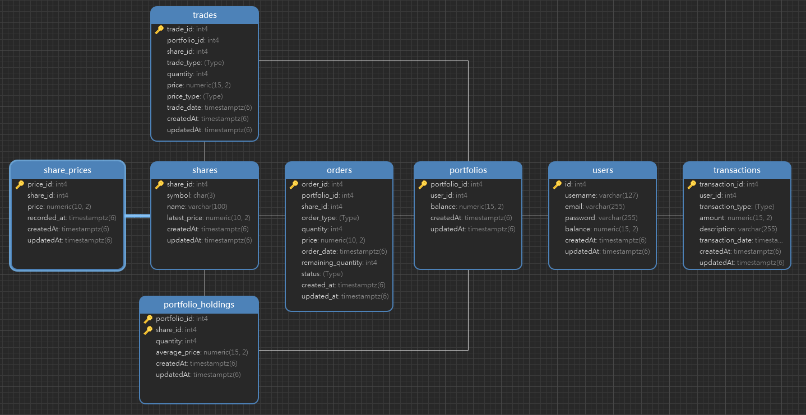

# **Exchange Trading System**

This Exchange boilerplate is a trading game simulation designed to educate users about stock trading terminology. This project provides a backend system that allows users to manage their portfolios, perform stock trading (buy/sell) market-limit operations, and track their transaction history. The project is built using **Node.js**, **TypeScript**, **Sequelize ORM**, and **PostgreSQL**.

## **Table of Contents**
- [Features](#features)
- [Installation](#installation)
- [API Documentation](#api-documentation)
- [Database Structure](#database-structure)
- [Testing (Not Implemented)](#testing)
- [Contributing](#contributing)
- [License](#license)

## **Features**
- User registration and authentication
- Stock registration (with price updates)
- Portfolio management
- Stock buy/sell operations Market or Limit
- Transaction(Deposit-Withdraw) logs and portfolio balance updates

## **Installation**

### Prerequisites
- Node.js (v20.x or above)
- PostgreSQL
- Git

### Step 1: Clone the Repository

```bash
git clone https://github.com/Andronovo-bit/Exchange-Service-Boilerplate
cd Exchange-Service-Boilerplate
```

### Step 2: Install Dependencies

```bash
npm install
```

### Step 3: Configure Environment Variables

The project uses a `.env` file to configure the database connection settings. Create a `.env` file by copying the example:

```bash
cp .env.example .env
```

Update the `.env` file with your PostgreSQL settings:

```env
DB_NAME=exchange_db
DB_USER=postgres
DB_PASS=password
DB_HOST=localhost
DB_PORT=5433
DB_SSL=false
DB_DRIVER=postgres

SERVER_PORT=7171
NODE_ENV=development

JWT_SECRET=secret
JWT_EXPIRATION=1d
```

### Step 4: Run Database Migrations and Seed

To create the database tables and seed initial data, run the following commands:

```bash
npm run dev (First run for database table sync and then stopping)
npm run migrate
npx run seed:all
```

### Step 5: Start the Application

To start the project in development mode:

```bash
npm run dev
```

To start the project in production mode:

```bash
npm start
```

The application will run on [http://localhost:7171](http://localhost:7171) by default.


## **API Documentation**

You can test the API endpoints using the `Exchange.postman_collection.json` file located in the root directory of the project. This file contains all the API endpoints of the application.

## **Database Structure**

The project uses the following database structure:

1. **Users**: Stores user information.
2. **Shares**: Stores registered stocks.
3. **Portfolios**: Stores user portfolios.
4. **Trades**: Logs buy/sell operations.(Market Operation)
5. **Transactions**: Logs deposit and withdrawal transactions.
6. **SharePrices**: Records stock prices.
7. **PortfolioHoldings**: Stores the amount of shares users hold.
8. **Orders**: Stores buy/sell orders. (Limit Operation)




***Migrations***

This project includes several migrations to handle complex database triggers and functions. Below is a detailed explanation of the key migrations:

**20240913130001-update_timestamp**

This migration creates a trigger to automatically update the updatedAt timestamp field on each table when a row is updated.

**20240916081658-update_user_balance**

This migration introduces a update_user_balance function that updates user balances based on transaction and trade operations.

**20240916114857-prevent_negative_balance**

This migration prevents users from making withdrawals that exceed their balance.

## **Testing** (Not Implemented)

To run the tests and ensure everything works as expected:

```bash
npm run test
```

This command will execute both unit and integration tests.

## **Contributing**

We welcome contributions! If you want to contribute, please follow these steps:

1. Fork the repository
2. Create a new branch (`git checkout -b new-feature`)
3. Commit your changes (`git commit -m 'Add new feature'`)
4. Push your branch (`git push origin new-feature`)
5. Open a **pull request**

We appreciate all kinds of contributions and feedback!

## **License**

This project is licensed under the [MIT](LICENSE) License.
